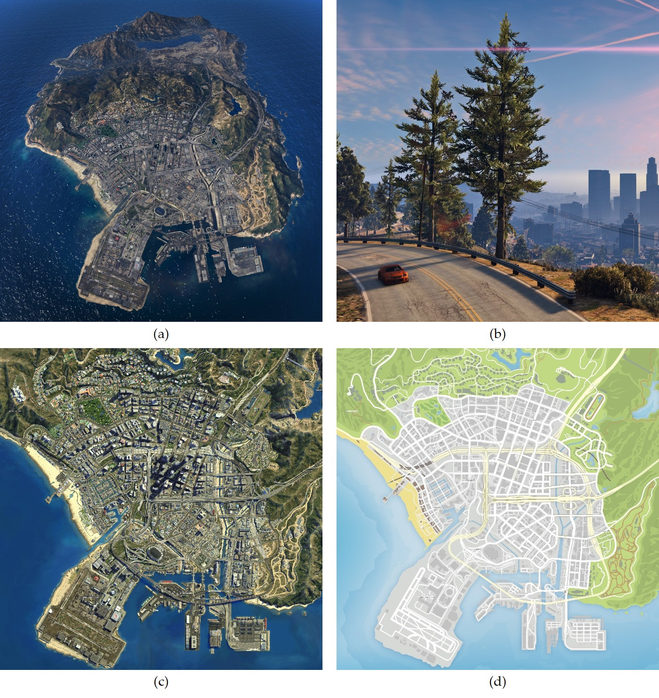
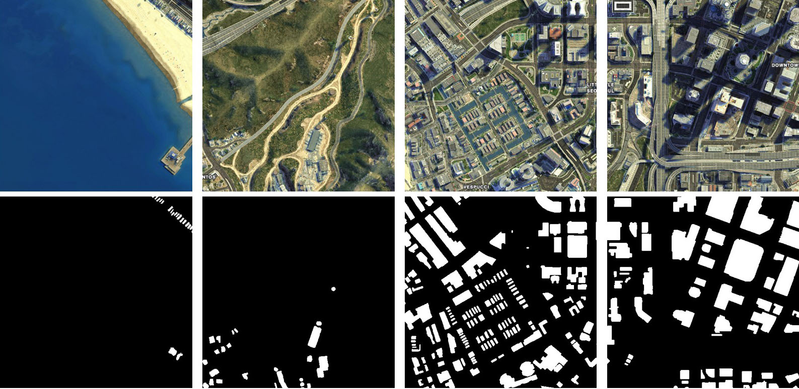

# GTA-V satellite imagery dataset (GTA-V-SID)
A synthetic satellite imagery dataset from the GTAV for semantic segmentation and domain adaptation.

Author: Tianyang Shi (shitianyang@buaa.edu.cn) and Zhengxia Zou (zzhengxi@umich.edu)

### Description of the dataset

We introduce a synthetic dataset for remote sensing image segmentation based on the well-known video game Grand Theft Auto-V (GTA-V).

The figure below shows an official map of the game GTA-V - the city of Los Santos, a fictional city featured in the game’s open world, covers an area of over 100 km^2 with unprecedented details: (a) The satellite imagery rendered from aerial view. (b) An in-game frame rendered from the “first-person perspective”. (c) A part of the game map that is used to build our dataset. (d) The legend of the map (in a similar fashion of Google maps). Different to the previous datasets  ([G. Ros et al. CVPR16](https://www.cv-foundation.org/openaccess/content_cvpr_2016/html/Ros_The_SYNTHIA_Dataset_CVPR_2016_paper.html); [S. Richter et al. ECCV16](https://arxiv.org/abs/1608.02192))  that focuses on rendering street-view images from the “first-person perspective” (like (b)), we build our dataset from the “aerial perspective” of the city (c,d).



We build the ground truth of our dataset based on its official map legend (8000×8000 pixels, provided by [Damon Pollard](http://blog.damonpollard.com/grand-theft-auto-v-the-map/)). We manually annotated the building regions in a pixel-wise manner. We provide two formats for our dataset: 1) 3000x3000 satellite map; 2) 500x500 slices. For the second format, the images are cropped with an overlap of 250 pixels. The follow table gives the statistics of our dataset.

| Dataset                | GTA-V-SID                                                    |
| ---------------------- | ------------------------------------------------------------ |
| Image Source           | GTA-V High-resolution Map (Los Santos, by [Damon Pollard](http://blog.damonpollard.com/grand-theft-auto-v-the-map/)) |
| Size of the map        | 8000x8000 pixels                                             |
| Resolution             | ∼1.0 m/pixel                                                 |
| Size of image slice    | 500x500 pixels                                               |
| Number of image slices | 121                                                          |

The follow figure shows four image slices from our dataset and the corresponding ground truth.




### Citation

For more details of our dataset, please refer to the follow paper.

```
@article{zou2020game,
  title={Do Game Data Generalize Well for Remote Sensing Image Segmentation?},
  author={Zou, Zhengxia and Shi, Tianyang and Li, Wenyuan and Zhang, Zhou and Shi, Zhenwei},
  journal={Remote Sensing},
  volume={12},
  number={2},
  pages={275},
  year={2020},
  publisher={Multidisciplinary Digital Publishing Institute}
}
```
